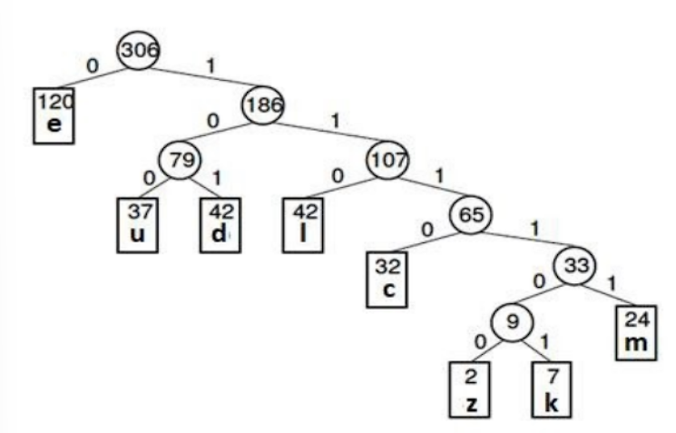
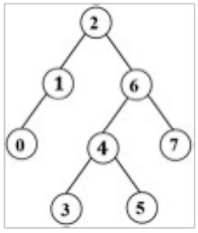

# Data Structures & Algorithms Assignments

---

## 📚 Assignments Overview

This repository contains solutions and descriptions for various assignments and exam questions from the Data Structures Laboratory course. Each assignment focuses on different core concepts in C programming and data structures.

---

## 📝 Assignment 1

1. **Third Largest Element**: Find the third largest integer in an array without sorting.
2. **Reverse Array**: Reverse the contents of an array in-place (no extra array).
3. **Big Integer Operations**: Add and subtract two integers with at least 10 digits each.
4. **Character Frequency in File**: Find the frequency of a character in a text file.
5. **Sparse Matrix Representation**: Efficiently represent an n x n sparse matrix.

---

## 📝 Assignment 2

1. **Binary String Manipulation**
   - Read a string of 0s and 1s from a file.
   - Break into substrings ending with 1 and of consecutive n (2, 3, 4) 0s or 1s.
   - Count frequency of each substring and verify total length.
   - Replace each pattern with a character (A, B, C, ...) and write to a new file.
   - Calculate % reduction in length after replacement.
2. **Sparse Matrix Operations**
   - Add and subtract two nxn sparse matrices using efficient representation from Assignment 1.

---

## 📝 Assignment 3

1. **Spiral Matrix Traversal**: Traverse a matrix in spiral order from any corner, with user choice of clockwise or anticlockwise.
2. **Tic-Tac-Toe Game**: Simulate a two-player game (machine vs user), display final board and declare winner.

---

## 📝 Assignment 4

1. **Stack Implementation**: Implement stack using array with push(), pop(), and display().
2. **Two Stacks in One Array**: Implement two stacks using a single array with push(), pop(), and display().

---

## 📝 Assignment 5

1. **Duplicate Stack**: Create a duplicate stack with same elements and order, restore original stack after operation.
   - _Example_: Original: 10, 12, 10, 15, 20, 10, 15, 20, 25 → Duplicate: 10, 12, 15, 20, 25
2. **Sort Three Stacks**: Sort elements from three stacks and merge into a single stack (no extra variables).

---

## 📝 Assignment 6

1. **Expression Evaluation**: Evaluate postfix and prefix expressions using stack (supports multi-digit numbers).

---

## 📝 Assignment 7

1. **String Priority Queue**
   - Lexicographically smaller strings have higher priority.
   - Functions: `enqueue`, `extractMin`, `merge` (union of queues).
2. **Sorted List Insertion & Timing**
   - Generate N random integers (0–10,000), insert into sorted list (array & linked list).
   - Run for N = 100, 500, ..., 10,000; print sorted list and timing.
   - Find average time for each N and method.

---

## 📝 Assignment 8

1. **Binary Trees**
   - Implement Complete Binary Tree and Binary Search Tree (BST) for N integers.
   - Implement in-order, pre-order, and post-order traversals for both trees.
2. **Huffman Coding Scheme**
   - Build Huffman Tree from input text and assign codes (0 for left, 1 for right).
   - _Example_: Frequency table and Huffman codes for sample words.
     
   - Calculate reduction in character count after encoding.

---

## 📝 Data Structure Laboratory Final Examination 2023

1. **Reverse Singly-Linked List**
   - Implement both recursive and non-recursive reversal using pointers (single pass).
   - Output NULL for empty list.
2. **Cycle Detection in Linked List**
   - Function to detect cycle in singly-linked list (no modification allowed).
3. **Grouped Priority Queue**
   - Priorities [0, 50) split into 5 groups; lowest value in group is processed first.
   - File input: Insert, Delete, Display operations.
   - _Input Format_:
     - `i x y`: Insert element x with priority y
     - `p`: Display queue
     - `d`: Delete element
4. **BST Path with Maximum Turns**
   - Given pre-order traversal, find path from root to leaf with maximum turns.
   - If tie, return shortest path; if still tied, return all shortest paths.
     

---
