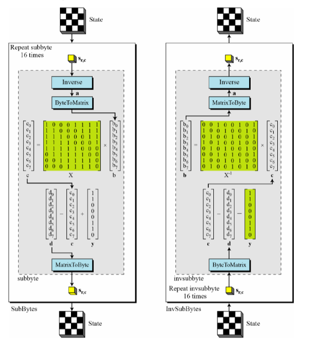

# Information & System Security Assignments

## Assignment 1

1. Write a C program to implement shift cipher with a given key value.

Test it for
"DONOT TRY TO COPY FROM OTHER ELSE YOU MAY BY CAUGHT" with key value 17.
Implement this with reverse shifting i.e. right to left.

2. Let EVE have received one ciphertext

FNULXVN CX RWOXAVJCRXW JWM BHBCNV BNLDARCH UJK
by sensing the channel. It suspects it to be shift cipher. Write a C program to decode the ciphertext.

3. Try to break a shift cipher from the statistical property of English language.
   " WNWJQGFW WPHWULK WPUWDDWFL JWKMDLK WPHWJAWFUW WFKMJWK WPUWDDWFUW OW FWWV LG WPUWD AF WNWJQ WXXGJL DWL WNWJQGFW KWW LZW WXXWULANW JWKMDLK OW SUZAWNW WPWJUAKW SFV DWSJF WNWJQ VSQ FWNWJ YANW MH CWWH LZW WFWJYQ ZAYZ WNWJQ UZSDDWFYW TJAFYK FWO WPHWJAWFUWK SFV WFVDWKK HGKKATADALAWK"

4. A modified shift cipher is designed in the following way.

First letter is encrypted by K, 2nd is K+1, 3rd is K+3 and so on.

The plaintext is

THOUGH IT IS A RAINNY DAY WE ALL HAVE COME TO LAB. COMPLETED THE GIVEN ASSIGNMENTS IN DUE TIME BUT WE ARE NOT PERMITTED TO LEAVE THE LAB.

Find the ciphertext.

Decrypt the ciphertext to receive the plaintext again. Take K=6

---

## Assignment 2

1.  S x a + t x b = gcd(a, b)

Find S and t using Extended Euclidean algo.

2. gcd(n,b) =1 Find the value t such that (b x t) mod n=1.

3. Find all pairs (b_i, t_i) within n ( let n=100) such that for each pair (b_i x t_i) mod n =1.
4. Write a program to encrypt

WE ARE LEARNING MULTIPLICATIVE CIPHER

using all the possible keys.

5.Consider Capital and small letters, digits, space, comma and fullstop in plaintext. Now encrypt the following text using multiplicative cipher with key 29.

We Are Planning For a FOOTBALL Match from 4.30 P.M. to 5.29 P.M. at LORDS Ground, just after the LAB class is over.

6. Let you are EVE and have received a ciphertext

ZENELLDSLEIEVSHDEWELPQDQFUQSECWASRSIACYPLALPGDZQSQGUKALIPGNY
you know the algorithm used is multiplicative cipher. Find the plaintext.

7. Try to get the plaintext from

SXSFEYNSSTJSWBQSTWSRRSNBFSQMRBSTJSFKSNWSSNQMFSQSTWSRRSNWSISNSSHBYSTWSRKNSXSFESDDYFBRSBSXSFEYNSQSSBZSSDDSWBKXSFSQMRBQISAWZKSXSSTSFWKQSANHRSAFNSXSFEHAENSXSFOKXSMJGSSJBZSSNSFOEZKOZSXSFEWZARRSNOSLFKNOQNSISTJSFKSNWSQANHSNHRSQQJYQQKLKRKBKSQ

using statistical property of English language.

(You know the cipher may be Additive of Multiplicative cipher).

---

## Assignment 3

1.Encrypt the plaintext

THEEXTRALABOFTODAYSTARTSATTWOPM

using Affine cipher With key pair (7, 11)

2. Consider Capital and small letters, digits, space, comma and fullstop in plaintext. Now encrypt the following text using Afine cipher  
   with. (For multiplicative take the 5th last and for additive take 56).

We Are Planning For a FOOTBALL Match from 4.30 P.M. to 5.29 P.M. at LORDS Ground, just after the LAB class is over.

3. Let you have received a ciphertext

OINNQOALKLSFUOFGLXHOLAOHLOOJFMR

and wants to get the plaintext. You know that the technique used is AFFINE cipher. But the order of additive and Multiplicative is not known.

4.  You have received a ciphertext as

GVAPYBPOHLKRFHOFYNIVYGANGHPQOXXNLAHFUBKFAPFVHNQPHONYZNOINPYHOPOVONILHMAFGVZNGSAPKKPLYO NYBPYNNAHLYGONZIYFKFBPHOHJIFILCNKNUOOINPAPYGNKPSKNRLADFCNAYVRNAFVHNYBPYNNAPYBRLACNKHLZAFHHOINNYOPANBKFSNHF JINOINAPOPHPYONAYHIPMFAWFSFASVHPYNHHZFYYNZOHPPNHOHIPSMVAPHOINSNHOMKLZNOFZFYYNZOJPOICNAXHFFYJNHILKKUKFLOOINLKVRYPRLYLBNRNYOMFAOLKOFZFYYNZOJPOILKKFUOINR

You know the technique is Affine cipher. Try to break it by using statistical property of English language
(You know the highest and second highest occurring characters in English language are 'E' and 'T').

5.  Let a new cipher you have proposed .

C1 = [(P + b1)*a + b2] mod 26
and
C2 = [(P *a1 + b)*a1] mod 26

where a is for multiplicative and b is for additive.

    Encrypt THEEXTRALABOFTODAYSTARTSATTWOPM using this new cipher and compare the key space.

---

## Assignment 4

1. Let you are EVE and the ciphertext received by you is
   OJLETXVNETWMFGCUANA

The encryption
algorithm is autokey cipher. Find the plaintext.

2. Encrypt
   A THIRD EYE IS OBSERVING BE ALERT
   (Without space) using key SECURE.

Using Vigenere Cipher.

3. Let you are EVE and have received a ciphertext

OIFZZGWRJGUIZGYUFQLPUHIJDGNVRWHYNGQRWGQYNQBZXBINWSZVWFYUYCUJHOYJFFWZUVYINHCJFBUUIWNZASWZUVYIBWNYYVYBJMMVYHIKMFYVJOWYHVUIFQNVWWMKMSJCFWHKJLNZXGBZKHYUYVLVJQBRWOWKJFMKTQLVFHYTNDBVWHYOY

you know the technique used is Vigenere cipher. Try to get the plaintext.

4.  Encrypt BE ALERT (without space) using playfair cipher.(Key matrix is A at bottom left and Z at top right)

5.  With the same key matrix decrypt

PBNEGNTMIOWDPBQEFIVL

6. Let take
   a string “HELLO WORLD” and a 5 X 5 table. Place the characters of the string considering
   from left to right but removing the duplicates. Then place the remaining characters
   from A to Z without taking ‘J’. Using this as the key of playflair cipher some plaintext
   is encrypted to “LFGDNWDPWOCV”. Write a program to find the plaintext.

---

## Assignment 5

1. Plaintext given (Do not remove spaces)

IIEST Shibpur owes its origin to the erstwhile Bengal Engineering College, the history of which goes to the nineteenth century when industries in the sense we understand today were practically absent. Prompted by the idea of meeting the requirement of trained engineering personnel for the Public Works Department the then council of Education Bengal decided to open Civil Engineering classes and a Professorship in Civil Engineering was created at Hindu College Calcutta

Chaotic logistic map is defined by  
 x*{n+1}=rx*{n}(1-x\_{n}),

where r are those in the interval [0, 4], so that xn remains bounded on [0, 1]

Generate a sequence of length 100 using key r=3.741 and x_n = 0.748

Take the last ten entries.

Sort those to get a permutation based on placeholder like (will be different for your case)

1 2 3 4 5 6 7 8 9 10

5 7 1 2 8 10 9 3 6 4

Break the plaintext into 10 columns (add extra character if length is not divisible by 10) and arrange the plaintext rowwise.

Permute the columns based on the permutation.

Represent the permuted columns by reading those columns.

Generate the ciphertext.

2. For this ciphertext you have received, try to apply Brute Force attack using different keys (different r only, different x_n only, both r and x_n are different).
   i) r=3.740, 3.74104, 3.730999
   but x_n = 0.748

ii)x_n = 0.747. 0.7469, 0.7470078
but r=3.741

iii) Mix of r and x_n

---

## Assignment 6: Fiestel Cipher

1. Take a plaintext. Divide it into 8 bit blocks. Perform the following operations in two
   rounds. The key is also 8 bit and the Key mixer is the bitwise XOR operation.
   Implement the encryption-decryption system.Let a S-Box is defined as
   i/p o/P
   00 10
   01 11
   10 00
   11 01

2. Avalanche effect tells that a small change in the input (plaintext or key) data results in a
   significantly different ciphertext. Justify this for this case.
   Take a parameter NBCR (Number of bit change rate)E(P1 K) =Ci
   F(P: K) =C,If i^th bit of C; and C> are same then “0’, else “1". Count total number of ‘1" and find percentage.

NBCR = ...

3. Implement Feistel cipher as shown over a plaintext by dividing it 8 bit blocks. L andR represents left and right half of each block. Key is taken as 8 bit. For odd round it rotates circularly left by 2 bits and for even it
   circularly rotates left by 3 bits. After rotation, for each cases the first and last bits are
   taken, then perform decimal, make the result square and again make it binary (fourbit).This is the key to be used in different rounds. The function f is the bitwise XOR
   operation.

4. Justify avalanche effect for this case also by taking NBCR (Number of bit change rate) as defined above.

---

## Assignment 7: AES [[Ref. doc](./Assn7/Assignment%20AES.docx)]

1. Write program to perform AES subbyte and inverse subbyte transformation.
   

2. Write a program to generate keys of different rounds of AES.

## Assignment 8: RSA

1. Write
   a program to implement cyclic attack on RSA. Take the ciphertext as 56210 and
   public keys
   are e=13
   and N=68681.

2. Write
   a program to generate a digital signature scheme using RSA.
